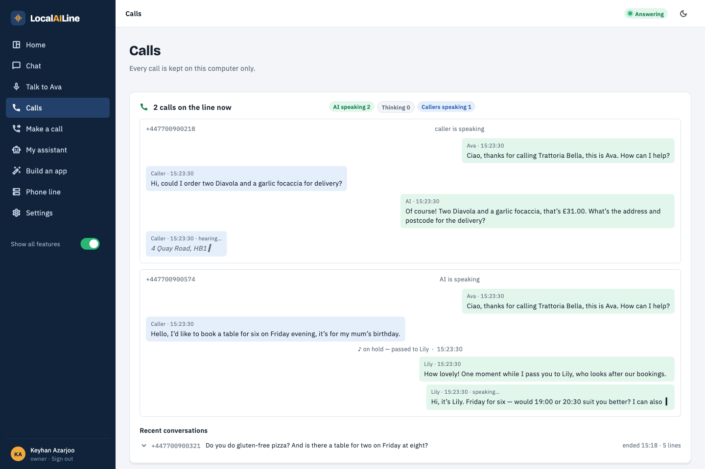
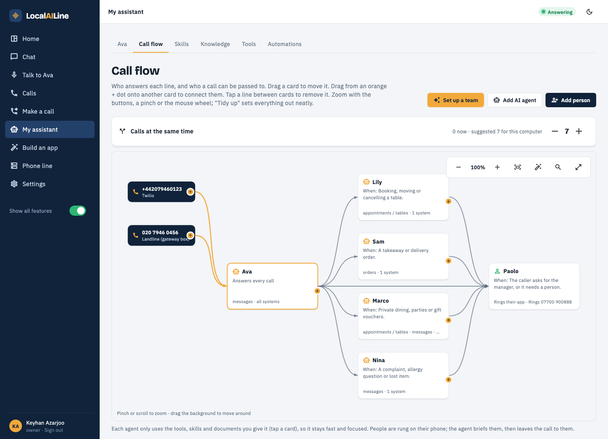
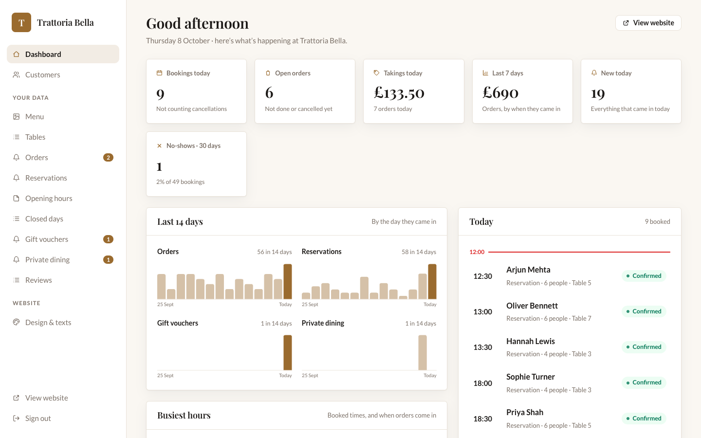
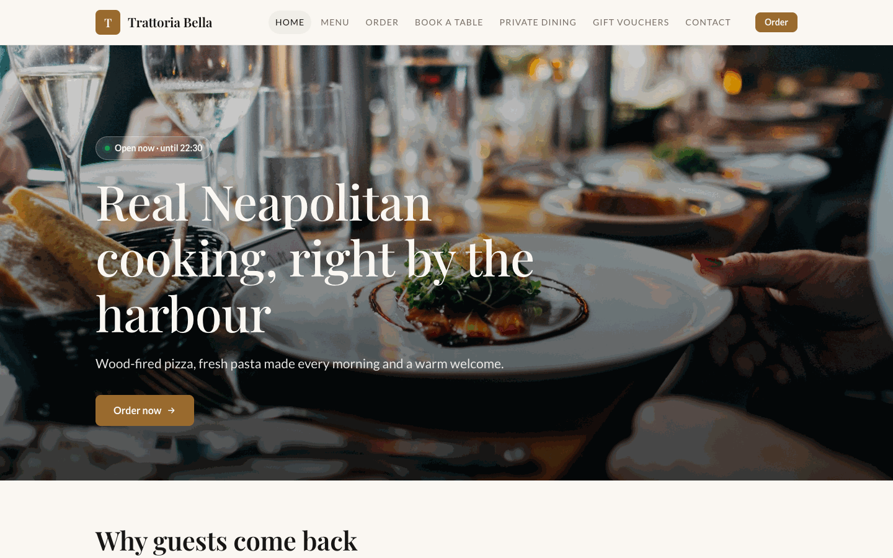
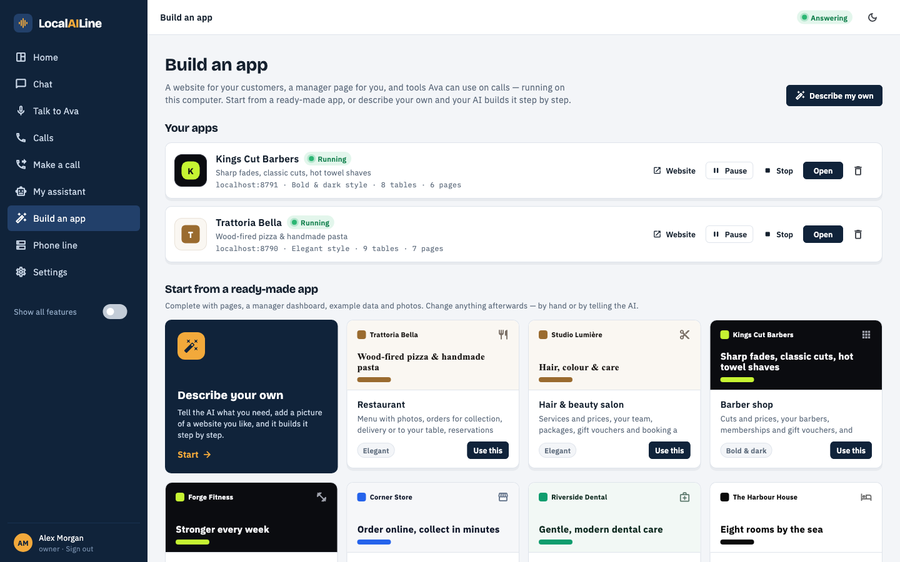
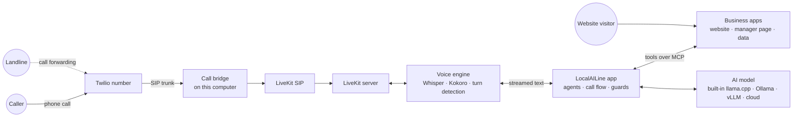

# LocalAILine: local AI call agents

**An AI receptionist that runs on your own computer.** LocalAILine answers your business phone with a team of AI agents, takes bookings and orders in websites it builds for you, and keeps every word of every call on your machine. There's no LocalAILine cloud, no account to sign up for, and no per-minute AI bill.



<table>
<tr>
<td width="50%"><br><sub><b>Call flow.</b> A receptionist, specialists and real people, linked by who can pass a call to whom.</sub></td>
<td width="50%"><br><sub><b>Your business app.</b> The manager page of a restaurant LocalAILine built: today's bookings, takings, busiest hours.</sub></td>
</tr>
<tr>
<td><br><sub><b>Your website.</b> Customers book and order here; the AI books into the same place on the phone.</sub></td>
<td><br><sub><b>Build an app.</b> Eleven professional templates, or describe your business and the builder designs one.</sub></td>
</tr>
</table>

## What it does

- **Answers real phone calls.** Connect a Twilio number in a few clicks; LocalAILine sets up the SIP trunk, registers this computer and answers. Keep your landline by forwarding it to that number.
- **Works as a team.** A receptionist answers and passes calls to specialists (bookings, sales, customer service) or rings a real person. The hold music plays, then the next agent speaks in their own voice, with a short brief so the caller never repeats themselves.
- **Builds your business app.** Restaurant, barber, salon, dental clinic, hotel, garage, gym, shop, tutoring, events or estate agent: each comes with a public website (booking, ordering with delivery, room finder, timetable…) and a manager page (dashboard, sortable tables, order board, calendars, customers). The AI uses the same app through MCP tools, so a phone booking and a website booking land in one place.
- **Knows your business.** Add documents and skills (a PDF of your menu, your policies); agents answer from them, each limited to what you give it.
- **Shows everything live.** See how many lines are busy, who is speaking, and each conversation word by word, as the caller is heard and as the AI answers. Calls can be recorded (callers are told).
- **Handles several calls at once.** The AI model, speech recognition and the voice all run in parallel, sized by one "Calls at the same time" setting for the computer it runs on.
- **Runs the AI where you choose.** Built into the app (llama.cpp, models downloaded for you), Ollama, any OpenAI-compatible server (vLLM, LM Studio, MLX, LocalAI, Jan), or a cloud provider.
- **Keeps people's data private.** A caller only ever reaches their own booking, checked by the number they call from *and* the name it's under; nothing about anyone else is ever read out. [Security model →](docs/SECURITY.md)

## How it works



1. A call reaches your Twilio number (or your landline, forwarded to it) and comes through the call bridge, a small program that keeps this computer registered with Twilio, so no router changes are needed.
2. The voice engine hears the caller with Whisper (a pool of servers so calls never queue), detects when they've finished speaking, and sends the words to the app.
3. The app picks the agent on the call, gives the model only that business's tools, and streams the answer back. The first words are spoken while the rest is still being written.
4. Bookings, orders and look-ups go through the business app's MCP tools, where the rules live: no double-booking, closed days, stock, capacity, and whose booking is whose.
5. When the caller is done ("No, that's all, thanks"), the assistant says goodbye and hangs up.

More in the [architecture notes](docs/PLAN.md).

## Getting started

Requirements: a Mac (Apple silicon recommended, 16 GB+ memory), [Flutter](https://docs.flutter.dev/get-started/install) 3.38+, [Homebrew](https://brew.sh). Windows and Linux hosts are planned.

```bash
brew install livekit whisper-cpp llama.cpp uv
git clone https://github.com/keyhan-azarjoo/local-ai-call-agents.git
cd local-ai-call-agents/app
flutter run -d macos
```

On first launch, create the owner account. The app then walks you through the rest: it installs the voice engine, downloads a speech model and an AI model sized for your computer, and offers to set up a business and a team. Full walk-through: **[Getting started](docs/guides/getting-started.md)**.

## Guides

| Guide | |
|---|---|
| [Getting started](docs/guides/getting-started.md) | Install, first run, the main pages |
| [Phone lines: Twilio and landlines](docs/guides/phone-lines.md) | Connect a number, answer calls, forward a landline, several calls at once, recording |
| [Business apps and websites](docs/guides/business-apps.md) | Templates, the app builder, your website, the manager page, how the AI uses them |
| [Agents and the call flow](docs/guides/agents-and-call-flow.md) | Receptionist, specialists, people, hand-overs, skills and knowledge |
| [AI engines and models](docs/guides/ai-engines.md) | Built-in llama.cpp, Ollama, vLLM and other servers, cloud; which model to choose |
| [Security and privacy](docs/SECURITY.md) | What callers, website visitors and the network can and can't reach |
| [Testing and evaluation](docs/TESTING.md) | The 2,143 spoken test calls, how to run them, and the results |

## Tested with over two thousand phone calls

The app is tested with **spoken** calls. Simulated callers (personas, accents, other languages, nosy or hostile callers) talk through text-to-speech, are heard through the app's own speech recognition, and are answered by the AI. Every call is then checked against the business app's data: was the table booked, at the right time, under the right name? Was nothing said about anyone else?

| Test set | Calls | What it covers |
|---|---:|---|
| Single calls | 1,150 | At least 100 per business: bookings, orders (collection, delivery with address, dine-in), questions, changes, cancellations, full days, closed days, out of stock |
| Journeys | 338 | Book → call back to change → someone else tries to cancel → cancel; teams and hand-overs; switching business; skills; website + phone together |
| Hard calls | 479 | Five-minute calls with detours and small talk, changing their mind, rude callers, spelling names, prompt-injection attempts, eight other languages |
| Security | 176 | Callers trying to get other people's details, cancel their bookings, pose as the manager, or break the AI's rules, across all 11 businesses |

Plus 230+ automated unit and widget tests: website and MCP rules for every template, attacks on the business apps' servers, call-ending logic, live-view rendering, and the model engines.

**Results:** 175 of the 176 security calls passed with **no data leaked**, and the remaining one is fixed. Every run's full conversations, tool calls, timings and failures are published in [docs/evaluations](docs/evaluations/), along with the [model comparison](docs/evaluations/MODELS.md). See [Testing and evaluation](docs/TESTING.md).

## Tech stack

| Part | Built with |
|---|---|
| Desktop app | Flutter (Dart), Provider, SQLite, Argon2id password hashing, roles and approvals for AI actions |
| Voice | LiveKit server + SIP, LiveKit Agents (Python), whisper.cpp, Kokoro and Piper voices, Silero VAD, multilingual turn detection |
| AI | llama.cpp (built in), Ollama, OpenAI-compatible servers, OpenAI / Azure / Gemini / Anthropic; local embeddings for search |
| Business apps | Generated from a JSON spec: Dart HTTP server, HTML/CSS/JS website and manager page, MCP server per app |
| Phone | Twilio Elastic SIP trunking, a Go call bridge (SIP registration), LiveKit SIP |
| Tests | flutter_test, a Python scenario generator, a spoken-call scenario runner, headless Chrome |

## Project layout

```
app/                 the Flutter app (desktop + phone companion)
  lib/state/         app state, call handling, scenario runner, test businesses
  lib/services/      voice engine, phone, AI engines, MCP, knowledge, business apps
  lib/ui/            pages (calls, call flow, builder, phone line, settings…)
  assets/engine/     the Python voice engine, speech lab, call bridge source
  assets/scenarios/  the 2,143 test calls
  test/              unit, widget, security and live tests; scenario tools
docs/                guides, security, testing, evaluations, screenshots
engine/              voice engine (development copy)
skills/              an example business skill (restaurant)
demo/                a static UI demo
```

## Status and roadmap

LocalAILine runs end to end on macOS: real Twilio calls, teams, business apps, websites, parallel calls, the live view and the built-in AI engine. Next:

- Telnyx, other SIP providers and FXO landline boxes connected directly (they can be saved now; Twilio works today, and a landline can be forwarded to it).
- Windows and Linux hosts.
- The phone companion serving an on-device model (Gemma 4 E2B/E4B) for the owner's chat and as an offline fallback.

## License

[Apache-2.0](LICENSE)
