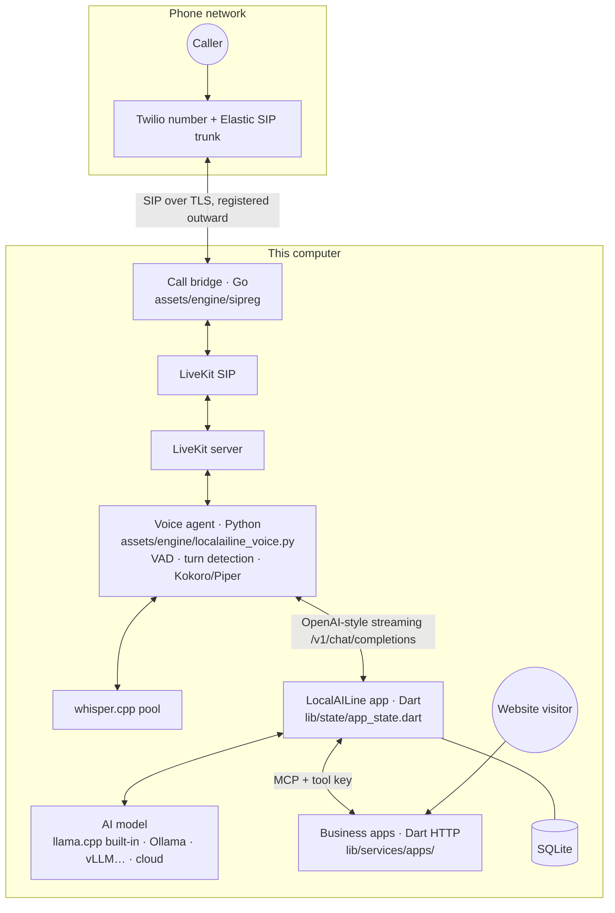

# Architecture

LocalAILine is one desktop app (Flutter) that runs and coordinates several local processes: a voice server, a voice agent, speech recognition, the AI model, and one small web server per business app. Everything listens on this computer. The only connections out are to Twilio for calls, Hugging Face for model downloads, and a cloud AI provider if you choose one.

## A call, step by step

1. **In.** Twilio sends the call to the SIP trunk LocalAILine created in the owner's account. The call bridge (`app/assets/engine/sipreg/main.go`) keeps this computer registered with that trunk, so calls arrive with no port forwarding, and hands them to LiveKit SIP on `127.0.0.1`. LiveKit puts each call in its own room (`pstn-in-<line>-_<number>_…`).
2. **Listening.** A LiveKit Agents worker (`localailine_voice.py`) joins the room in its own process. Silero VAD and a multilingual turn detector decide when the caller has finished. Streaming speech recognition runs on whisper.cpp servers in a pool, so parallel calls never queue behind each other, with a larger model for hard languages.
3. **Thinking.** The agent sends the conversation to the app's own OpenAI-compatible endpoint. The app (`agentReply` in `app_state.dart`):
   - finds which agent is on the call (the call flow);
   - builds a system prompt that stays the same on every turn, so the model can reuse it;
   - gives the model only the called business's main tools;
   - streams the answer back as it's written.
   Around the model there are guards:
   - the caller's own number is forced into "my booking" tools;
   - days and times are taken from what the caller said;
   - saving happens when the caller says yes;
   - hand-overs are recognised, even with misheard names;
   - the goodbye is handled.
4. **Speaking.** The agent speaks the first clause as soon as it arrives, then sentence by sentence, in the agent's Kokoro voice. A hand-over marker plays hold music and switches to the next agent's voice.
5. **Acting.** Bookings and orders go through the business app's MCP tools (`app_server.dart`). The app enforces availability, closed days, stock, capacity, and whose booking is whose.
6. **After.** The transcript, a summary, timings per stage and an optional recording are saved.

## Main parts

| Part | Where | Notes |
|---|---|---|
| App state and call handling | `app/lib/state/app_state.dart` | One `ChangeNotifier` that holds sessions, settings, the call flow and the call-turn pipeline. It's large (≈3,900 lines); splitting it into call-session, call-flow, engine-settings and companion services is the next refactor. |
| Model loop | `app/lib/services/agent_loop.dart`, `openai_compat.dart`, `cloud_llm.dart`, `builtin_llm.dart` | One tool-calling loop for every engine. Streaming, tool-call assembly, small-model tool selection, warm-ups. |
| Voice engine control | `app/lib/services/voice_engine.dart` | Starts LiveKit, LiveKit SIP, Redis, whisper servers and the Python worker. Sizes them by "calls at the same time". |
| Phone | `app/lib/services/phone.dart` | Sets up the Twilio trunk, credential list and number; LiveKit trunks and dispatch rules. |
| Business apps | `app/lib/services/apps/` | `app_spec` (the description: tables, fields, access, pages, privacy repairs), `app_data` (records, availability, stays, capacity, totals), `app_server` (website API, manager API, MCP tools, security), `app_web` (the generated website and manager page), `app_templates` (11 templates), `app_builder` (the AI builder). |
| Knowledge | `app/lib/services/knowledge/` | Documents and skills, chunked and embedded locally. Its own small embedding server, so search never waits behind calls. |
| MCP client | `app/lib/services/mcp/` | HTTP/SSE/stdio transports, OAuth 2.1 with PKCE and dynamic registration. |
| Companion | `app/lib/services/companion/` | Phones pair with the desktop: answer calls, chat, approve actions. |
| Test harness | `app/lib/state/scenario_runner.dart`, `test_businesses.dart`, `app/test/scenarios/` | Spoken test calls (see [TESTING.md](TESTING.md)). It lives in `lib/` because it runs inside the app, where you can watch it live. |

## Design decisions

- **Rules in code, not in the prompt.** A 4B model on a laptop can be talked into things. Everything that protects data or money is enforced in the business app and the call guards:
  - whose booking it is;
  - availability;
  - never speaking tool syntax;
  - only carrying out a cancellation the caller confirmed.
  Some guards are heuristic (English phrasing for "yes", "that's all", a promised save). They're deliberately narrow and unit-tested, and they fall back to the model in other languages.
- **One description, three surfaces.** A business app's JSON spec generates its website, its manager page and its MCP tools. A rule added once applies to all three.
- **Parallel by design.** Model slots, a hearing pool and one voice process per call, all sized by a single setting.
- **Measure, then fix.** Every turn logs its stage timings. Slowdowns were traced to memory pressure (model working memory, a prompt cache, leftover processes) and to prompts that couldn't be reused, not guessed at.

## Known limitations

- Provider credentials (Twilio token, cloud API keys) are stored in the app's local database, readable by the user account, not yet in the macOS Keychain.
- Business websites and the companion server listen on the local network so phones and visitors can reach them; the AI's tools and manager pages are protected (see [SECURITY.md](SECURITY.md)).
- macOS only for now. The Windows and Linux runners are scaffolding.
- Answer times on a 16–18 GB laptop are several seconds. Bigger machines and models help most.

The original design plan, written before implementation, is kept in [history/PLAN.md](history/PLAN.md).
